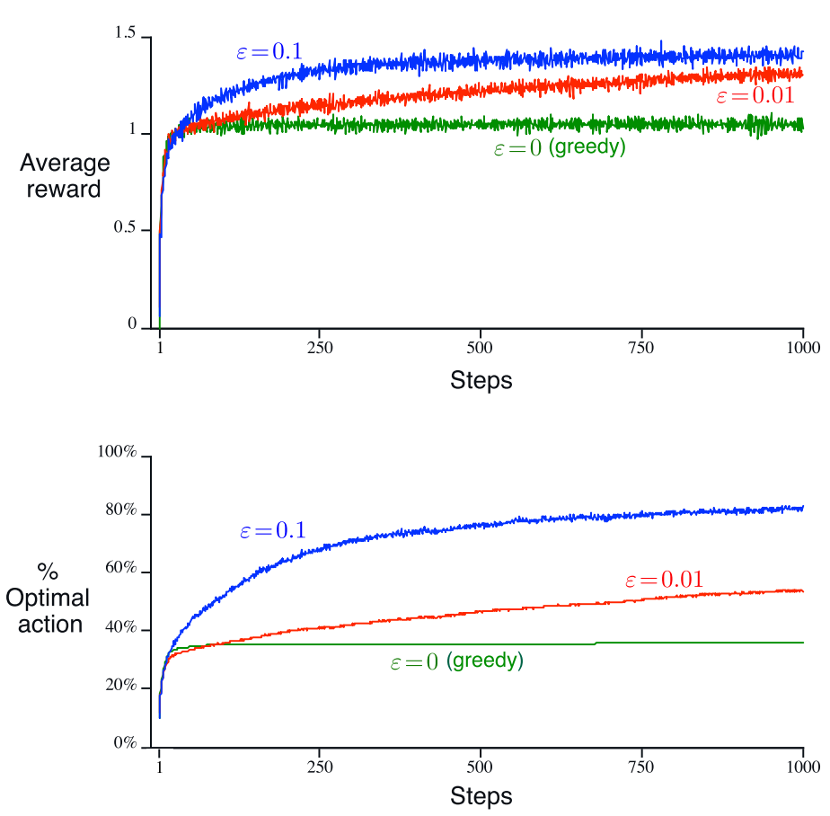

# Action-Value Methods #

* *Action-value methods*:
  * The true value of an action is the mean reward when that action is selected.
    * $Q_{t}(a) = \frac{\text{sum of rewards when \textit{a} taken prior to \textit{t}}}{\text{numbers of times
      \textit{a} taken prior to \textit{t}}} = \frac{\sum_{i=1}^{t-1}R_{i} \times
      \textbf{1}_{A_{i=a}}}{\sum_{i=1}^{t-1}\textbf{1}_{A_{i=a}}}$
        * *Sample-Average*
        * $\textbf{1}$ denotes the random variable taht is 1 if *predicate* is true and 0 if it is not.
  * Greedy-action: $A_{t}= \underset{\textit{a}}{argmax} Q_{t}(a)$
      - Select high estimate value actions.
* *e-greedy*
    - Simple alternative to only greedy-algorithm.
    - Using distribution probability(usually uniform) as action making
      - If distribution is uniform, all actions will be equally likely to be selected regardless of *value*
      - *Exploitation*: 1 - $\varepsilon$
      -  *Exploration*: $\varepsilon$
* Comparison:
  * If reward function has a low variance, probably *non-greedy* algorithm will perform better, however, for high
    variance, exploration is a key for performance, so *e-greedy* is likely to perform better.
      - Greedy will find optimal action sooner.
      - *Nonstationary*: Better with exploration
* In that case $\varepsilon = 0.01$ will performer better because both e-greedy solutions will reach optimal value
  function, but $\varepsilon = 0.01$ going to have 10 times more chance to choose a optimal action than $\varepsilon = 0.1$, in a long run.
* Average reward function value is computational inefficient.
  - [Action-Value Method Incremental Implementation](20200929172744-value-method_incremental_implementation.md)

* These methods above are *biased* by their initital estimates
  * [Optimistic Initial Values](20200929192801-optimistic_initital_values.md)

* [Upper-Confidence-Bound Action Selection](20200929194903-upper-confidence-bound_action_selection.md)

Backlink: [Multi-Armed Bandits](20200928183306-multi-armed_bandits_.md)
----
