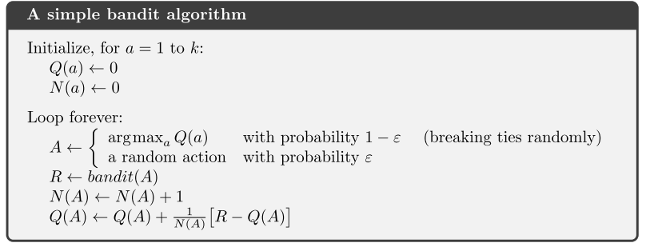

# Action-Value-Method Incremental Implementation #

- More efficient than non-incremental variation
- It is not necessary infinite memory
- Only uses *old_estimate*, *last reward*(target) and *step_size*
  - *step_size* = $\alpha$

$$\begin{aligned}
Q_{n+1}=& \frac{1}{n} \sum_{i=1}^{n} R_{i} \\
=& \frac{1}{n}\left(R_{n}+\sum_{i=1}^{n-1} R_{i}\right) \\
=& \frac{1}{n}\left(R_{n}+(n-1) \frac{1}{n-1} \sum_{i=1}^{n-1} R_{i}\right) \\
=& \frac{1}{n}\left(R_{n}+(n-1) \sum_{i=1}^{n-1} \frac{R_{i}}{(n-1)}\right) \\
=& \frac{1}{n}\left(R_{n}+(n-1) Q_{n}\right) \\
=& \frac{1}{n}\left(R_{n}+n Q_{n}-Q_{n}\right) \\
=& Q_{n}+\frac{1}{n}\left[R_{n}-Q_{n}\right] \\
\end{aligned}$$

- Equation above hlds for $n=1$, obtaining $Q_{2} = R_{1}$ for arbitrary $Q_{1}$.
- $NewEstimate \leftarrow OldEstimate + StepSize [Target - OldEstimate]$
- Error: $[Target - OldEstimate]$
  - Taking a step forward to $Target$, which indicates a desireble direction for *values*
  - However this $Target$ can be a noise sometimes
- A bandit algorithm:[Multi-Armed Bandits](20200928183306-multi-armed_bandits_.md)

## Non-stationary Problem

- The reward probability do change over time
- This kind of problem is more common in RL than stationary ones
- So make sanse to give more weight for last rewards than old ones.
  - Using a constant step size is possible to achieve it  with $\alpha \in (0,1]$

$$\begin{aligned}
Q_{n+1}=& Q_{n}+\alpha\left[R_{n}-Q_{n}\right] \\
=& \alpha R_{n}+(1-\alpha) Q_{n} \\
=& \alpha R_{n}+(1-\alpha)\left[\alpha R_{n-1}+(1-\alpha) Q_{n-1}\right] \\
=& \alpha R_{n}+(1-\alpha) \alpha R_{n-1}+(1-\alpha)^{2} Q_{n-1} \\
=& \alpha R_{n}+(1-\alpha) \alpha R_{n-1}+(1-\alpha)^{2} \alpha R_{n-2}+\\
\cdots+(1-\alpha)^{n-1} \alpha R_{1}+(1-\alpha)^{n} Q_{1} \\
&=(1-\alpha)^{n} Q_{1}+\sum_{i=1}^{n} \alpha(1-\alpha)^{n-i} R_{i}
\end{aligned}$$

- The sum: $(1 -\alpha)^{n} + \sum_{i=1}^{n}\alpha(1 - \alpha)^{n-i} = 1$
- The weight decays exponantitally accodring to the exponent on $(1-\alpha)$
  - If $1 - \alpha = 0$, the all the weight goes ton the very last reward.
    - $0^{0} = 1$
- When $\alpha$ is different from $\frac{1}{n}$, like $\alpha \in (0,1]$, the first one converges but the second one
  doesn't obey rules for convergence happens. It is desirable since when it is a non-stationary problem and the
  probability reward change across the time, we would like to change *values* according to change of probability.
- [Optimistic Initial Values](20200929192801-optimistic_initital_values.md)

Backlink: [Action-Value Methods](20200928190836-action-value_methods.md)
----
