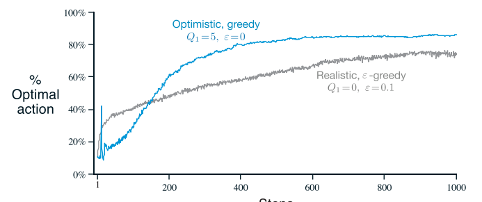

# Optimistic Initial Values #

- We can use optimistic values to force *exploration*
- As example: Suppose we have a normal distribution for a function reward with $mean = 0$ and $var = 1$.
  - In case, we initialize our $Q(a)$ for all actions = +5, probably the algorithm will be disappointed because the
    value it is receiving from reward function is far away from the true value $q_{*}$ and consequently it will explores other actions.
  - "The result is that all actions are tried several times before the value estimates converge", Sutton , Page 56
- Comparison with *greedy* with $Q_{a} = +5$ and $\varepsilon$-*greedy* with $Q_{a} = 0$
  - The first one explore much in the beginning, but after exporation decreases with time and then performer better.
- **WORK GOOD FOR STATIONARY PROBLEMS**
  - "It is not well suited to nonstationary problems because its drive for exploration is inherently temporary",
    Sutton, Page 56
  - Methods focusing on the initital conditions in any special way is unlikely to help with the general
    nonstationary case.

Backlink: [Action-Value Methods](20200928190836-action-value_methods.md)
----
