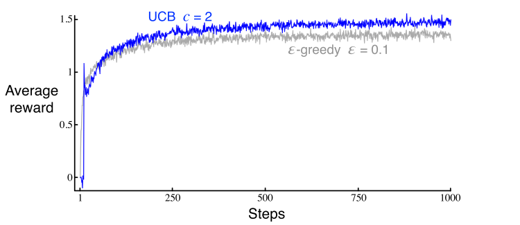

# Upper-Confidence-Bound Action Selection #

- Exploration actions is necessary to achieve better rewards.
- However, when the algorithm will choose a *non-greedy* action, it normally doesn't use any kind of preference
- Selecting *non-greedy* with potential to be optimal, taking into account both how close their estimates are to being
  maximal and the uncertainties in those estimates.

$$A_{t} \doteq \underset{a}{\arg \max }\left[Q_{t}(a)+c \sqrt{\frac{\ln t}{N_{t}(a)}}\right]$$

- $N_t(a)$ denotes the number of times that action a has been seelcted prior to time t
- $c$ controls the degree of exploration.
- $ln(t)$ logaraithm natural of *t*
- Square-root: MEasure of the uncertainty or variance in the estimate of action value.
- Each time a action is selected the uncertainty term in equation above reduce as $N_{t}(action)$ increases, and as it
  appears in the denominator, the uncertainty term decreases.
- If any another action than A is selected, the *t* increases, and uncertainty about action A increases also.
- Logarithm natural means that the increases get smaller over time, but are unbounded
- "All actions will eventually be selected, but actions with lower value estimates, or that have already been selected
  frequently, will be selected with decreasing frequency over time." Sutton, Page 58
- UCB is not pratical for nonstationary problems and can really complexy when using function approximation to deal with
  *values*

Backlink:
----
