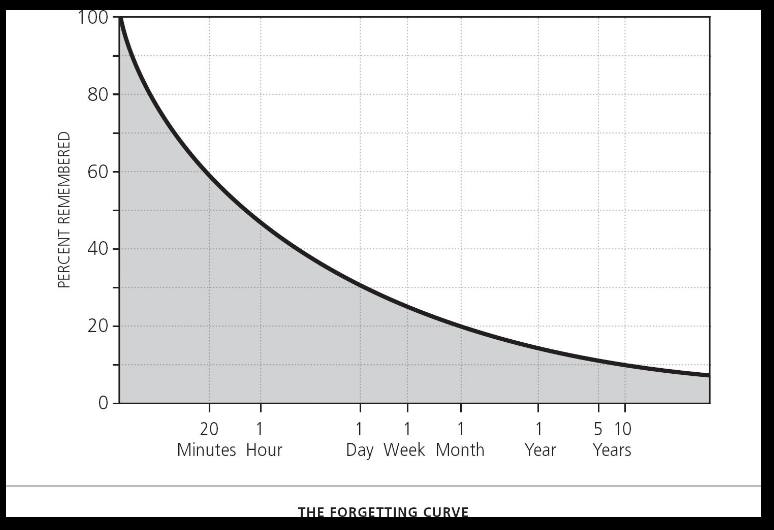

# Maximize Laziness #

- Curve above reveals how rapidly we forget and that remains once we've forgotten.
- Extra repetition or rote repetition doesn't help long-term memory, only short.
- Take a lazy route instead: study a concept until can repeat it once without looking and then stop. After all, *lazy*
  is just another word for "efficient".

Backlink: [Five Principles to End Forgetting](20200929215057-five_principles_to_end_forgetting.md)
----
