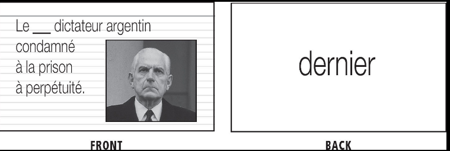

# Learn Important Words First #

- Some words are more important than others. So we need to learn them first.
- You'll need a few nouns before you can put something "in" them or "on" them. Still, even if you set functions aside
  for a moment, you'll find a small group of useful, simple words that you use *all the time*.
- **Use frequency word list**
  - This list change by target language you want learn.
- Thousand words will make your recognize nearly 75 percent of each text you read.
- Use *phrasebook*  or grammar glossary to search words. There are basic words there.
- Try to search word in your target language, because it can create a surprise in your mind and it is important to
  create personal connections and improve the memory to remember.
  - **SPOT THE DIFFERENCES GAME**
- Use images to memorize words. (Using Google images for instance.)
- **Personal connections**:
  - What's your grand-mère's\[foreign\](grandmother's ) name? Which chat(cat) comes to your mind?
  - Concrete Nouns: When is the first time I encountered a *moto*(foreign word for motorcycle) ?
  - Abstract Nouns: How has the *économie*(economy) affected me?
  - Am I *timide*(timid)? If not, do I know someone who is?
  - Do I like to *courir*(run)? Do I know someone else who does?
  - *Stick to names of people and places* they don't violate our no-Native rule
- Some language have gender roles for words.
  - Some grammar books tell about gender rules in the beginning
  - Assign each gender a particularly vivid action(like exploding, flaming, melting, cracking or shattering ) and then image each of your
    nouns performing this action
    - We're really good at remembering images, particularly when those images are violent, sexual,m funny, or any
      combination of the three.
- *Only use translation if you don't yet speak the language*
  - **BUT ALWAYS MAKE FLASHCARDS IN TARGET LANGUAGE**
- If you don't a good picture for a word, but you know what your word means, then you can search for a suitable picture
  in English(Native Language).
  - But, you can't tell what your word means, then skip it. The word is too complex and multifaceted than you can handle
    right now.
- **RULES**
  - Skip words you know
  - Words you kind of now when you look them in a context, put in flashcard (**REFRESHER TRACK**)
  - Words you do not know(**NORMAL OR INTENSIVE TRACK**)
- After that, learn thematic vocabulary
  * [Thematic Vocabulary](20201016160245-thematic_vocabulary.md)I
- Use Images to remember a specific word and fill the gap in sentence

  * Searching for a specific vocabulary increase your chance to remember the word 
- 

Backlink:
----
