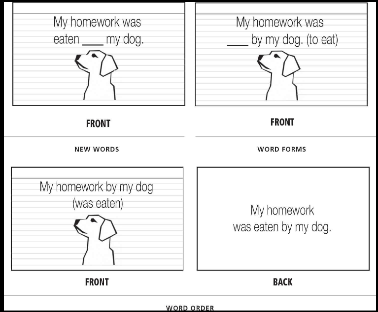
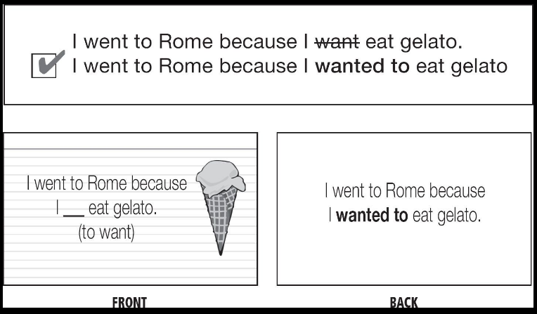
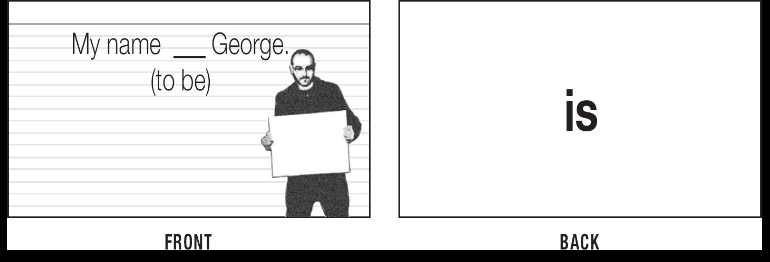

# Language's Grammar#

* Grammar rules are worth learning; studies show that you'll learn a language faster when you learn the rules.
  * However,don't need to drill them or study it extensively
  * Just pick out a one example or two that you find particularly interesting, make a flashcard for them, and you will
    have that grammar memorized forever.
* Use your language machine -- the pattern-crunching tool that taught you the grammar of your native language. This
  machine runs off of comprehensible input- sentences that you understand -- so you will need to find a good source of
  simple, clear sentences with translations and explanations.
  * Use a grammar book with simple sentences, because simplicity make the learning easier.
  * Use a pattern to derive grammar rules, for example third person verb (likes, loves, hates) when you have
    he,she and it pronouns. Try to find patterns to understand a grammar
* **Make stories to learn grammar with flashcards**:
  * He eats ice cream
  * It loves playing guitar
  * He is a doctor
  * *Instead of*: She ___ (to be)
* Every language's grammar depends upon these three operations to turn their words into stories
  * Add words
  * Change word forms
  * Change words' order.
* Ask yourself always when you want to learn a new grammar rule:
  * Do you see any new words here?
  * Do you see any new word forms here?
  * Is the word surprising to you?

* Some words that have abstract concepts is a little difficult to learn
  * Good examples of sentences will help you remember what word means
    * Just skip it when you do not understand.
* Irregular verbs have patterns also
  * steal/stole/stolen
  * choose/chose/chosen
  * [PAO(Person-Action-Object)](20201014150909-pao-person-action-object.md)
* Declension charts are good to give you some patterns
  * Use stories to cover every new form you need in the declension charts
    * Use a simple sentence.
  * Create your own sentences using the examples on declension charts
    * One flashcard per example.
    * Submit them to Lang-8 or Italki
* Turn stores into illustrated flash cards
* Use [PAO(Person-Action-Object)](20201014150909-pao-person-action-object.md) system to learn patterns and how to memorize them
* Self-directed writing is the ultimate personalized language to learn grammar.
  * You will write about whatever you want to learn.
  * Get them corrected by native whenever possible.
* Use Lang-8 or Italki as resource to correct your sentences with native speaker of the target language.
  * Put every correction you receive into your flashcards.

* Use your grammar book as example of well structured sentences.
  * Don't fill SRS with almost-identical examples of the same rule. Just take on or two, and turn them into a
    flashcards.
* **NEW WORDS**:
  * First step
  * Don't need to know if a word is new or is a new form, after some time you will discover it
  * **SPOT THE DIFFERENCES**
  * Try to search word in your target language, because it can create a
    surprise in your mind and it is important to create personal
    connections and improve the memory to remember.
  * Use mnemonics for gender and personal connections to remember.
  * 
  * Use for other others too like:
    * *I ____ a pet monkey(Have)*
  * It is important to make these flashcards yourself
* **NEW WORD FORMS**:
  * If you notice that the word is a new form of verb *to be* for example, it is possible to make flashcards indicating
    what form is expected to fill the gap.
  * 
* **WORD ORER**
  * Where to put your words.
  * I have a monkey(insert *pet*)
  * I a pet monkey(insert *have*)
* You can use same image if you pick apart a sentence into a bunch of little pieces, or you can use multiple images.
  * The former is fast and easy to make. The latter will be easy to remember.
* For abstract nouns like *honesty* find a picture of wherever comes to mind or a picture of *anyone* who would say a
  sentence with *honesty*
* **WRITE! - CREATE YOUR OWN SENTENCES**.
* Learn thematic vocabulary
  * [Thematic Vocabulary](20201016160245-thematic_vocabulary.md)
* Try to use monolingual dictionary as source of input when you have enough vocabulary
  * Try to use one containing pre-made sentences.
* Reading is the better way to improve our vocabulary
  * Every novel will increase your vocabulary by three hundred to five hundred new words and dump buckets of grammar
    into that language machine in your head.
    * Try to find familiar story- books you have already ready or turned into a movie
    * "The audiobook will carry you along and help you read faster than you otherwise would. You won't have the
      time to get bogged down with unknown words, and you'll pick up the rhythm of the spoken language." (Fluent
      Forever, W. Gabriel, Page 153)
    * Reading without a dictionary is the simplest, easiest way to grow your passive vocabulary.

Backlink:
----
