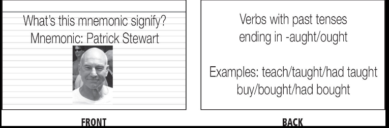

---
title: PAO(Person-Action-Object)
date: 2020-10-14 15:09
tags: :method:learning:pattern:system:memorize:language:
type: note
---

# PAO(Person-Action-Object) #

* PAO relies upon a simple premise: the three basic ingredients of a story are a person (Arnold Schwarzenegger), an
  action(explodes), and an object(a dog). (Fluent Forever, W. Gabriel, Page 127)
* Ex:
  * Arnold Schwarzenegger (plural form 1) explodes (masculine gender) a dog
    * German grammar
    * Weird, vivid, and compact story that could tell you the gender and plural form for our poor German dog.
* Use this system to learn pattern on irregular verbs.
  * Action: *fight/fought, buy/bought, think/thought*
  * Mnemonic person or object to represent the "past tense ends in -ought"  pattern.
* Any time you run into a tricky pattern, choose a person, action, or object to help you remember. For verb patterns,
  pick a mnemonic person or an object. For noun patterns, use a person or an action. Adjectives fit well with objects,
  and adverbs fit well with actions.

* It is useful for declension charts

Backlink: [Language's Grammar](20201013010729-language_grammar.md)
----
