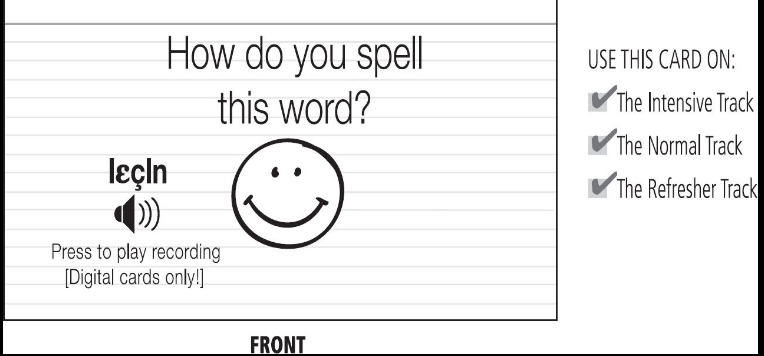
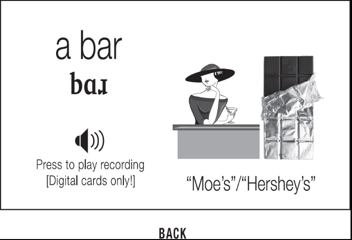

# Learn Language with Flashcards #

* Learn thirty flashcards a day.
* Get a specific word like "lunch"
  * Connect it to a tasty memory
    * Your mind will remember a tasteful food every time you see the word "lunch"
* Try to use pictures instead of translations
  * When you search in Google for specific noun, you create memories and your flashcards will trigger these memories
* Link personal connections, sounds, spellings and concepts for each word you want to learn
  * [Pronunciation and Broken Words](20201010172915-pronunciation_and_broken_words.md)
  * [Make Memories More Memorable](20200929215147-make_memories_more_memorable.md)I
* Many simple cards are better than a few complex cards
* Always ask for one correct answer at a time
* "What's on the back side of this card?"

* "LiLy" above is a personal connection
* Essential:
  * Picture: Can you remeber what this word means? What's it look like?
  * Pronunciation: Can you say this word out loud?
* Bonus Points:
  * Personal Connections: Can you think of any personal connections with this word? (Do you like cats? Can you think of
    a cat you know?)(My cat's name is Lily.)
  * Similar-sounding Words: Can you think of any other(Target Language) word that start with the same sound or spelling?
  * Related words: Can you think of any other (Target Language) words that relate to this word in meaning?(Words related
    to cat: tail,dog,animal,specie)

* Is is necessary to answer correct the essential points. Then take a time between 10-20 seconds to remember bonus
  points.
* "The more cards you make per word, sound, or grammatical concept, the easier time you'll have."
* Use minimal pairs to understand similar and difficult sounds
* Sound flashcard:
  * What' this sound? What is  it like?
    * IPA and grammar/pronunciation book
  * Spelling: How do I spell this sound
    * Grammar book or dictionary
  * Example word: What's an example word for this sound?
  * **Card type 1**: What does this spelling sound like
  * 
  * 
  * **Card type 2**: How do you spell this example word?
  * 
  * **Essential Fact**: What sound this spelling make? Can you it out loud? *MAKE FLASHCARDS FOR  DIFFERENT SOUNDS WITH APPROPRIATE EXAMPLE*
  * **Bonus Point**: Can you pronounce the whole word rather than just the sound in the middle of it? Can you thin of
    any other word that uses this sound? Remember how is is spelled, pronounced, or what it means?
  * Choose example words that are easy to visualize. As example: nouns
    * If it is a abstract word, find some similarly spelled words in the glossary at the end of your book.
* Learn the first top thousand words for your target language.
* Vocabulary flashcard:
  * Spelling: How do I spell this word?
  * Pronunciation: How does this word fit into my mouth?
  * Picture -- Spot the difference game: What does this word really mean?
  * Personal connection -- The memory Game: What's this word mean to me? When was the last time I encountered this
    thing/action/adjective?
  * Gender -- The Mnemonic Imagery Game(If your language uses grammatical gender): If this word is a noun, what's the
    gender of the word?
  * **Card type 1**: What's this word mean? Can you say it out loud? (Refresh track, intensive, normal track)
    * Essential Facts: Picture: Can you remember what his word means? Pronunciation? Gender?
    * Bonus: Personal Connection and other words that are similar in spelling or meaning.
    * 
    * 
  * **Card type 2**: What's the word for this image? Can you say it loud? (Normal track, and intensive only)
    * Essential Facts: Pronunciation and Gender
    * Bonus: Spelling, personal connections, other words
    * 
    * 
  * **Card type 3**: How do spell this word? (Intensive Track only)
    * Essential Facts: Spelling
    * Bonus point: Gender ,personal connections, other words
    * 
    * 
  * **MULTIPLE DEFINITIONS**
    * Put main definition on the back side, or you can put multiple definitions there(If remeber any definition,
      then mark it as correct)
    * 
  * **SYNONYMS**
    * 
    * 
  * **CATEGORY**
    * Use animals word in the back for example when you try to learn "animal".
    * Don't be afraid to make a mistakes, you create these cards so you know what you want.
  * **CONFOUNDED IMAGES**
    * A image can represent many things: child's photos can be a niece or daughter.
      * Add a personal note to these cards -- your niece's name
      * or add a short word of the target language as clue
      * 
      * 
  * **Mnemonic Imagery**
    * Help to remember gender, preposition, verb conjugation and etc, in your target language:
      * You wouldn't  want to accidentally explode some poor feminine noun when it should be burning instead.
      * 
* Type of cards: new words, word forms, wor orders
    * Good sentence, phrase , or dialogue
        * "I'm going to disneylayd! 
        * Use your grammar book as example for sentences."
    * **The story**: What's going on in this sentence or dialogue? When might you encounter this situation?
    * **The chunks**: What does each word mean individually? What role does each word play in this sentence? How to
      pronounce each of the word.s
    * Is the word in a base form? 
    * **Pictures**: What are some good pictures for this sentences? Can you use a few different pictures to help you
      remember the meanings of each individual word?
    * **Personal connections**: It is hard to use personal connections with complex vocabulary.
    * New words:
        * Card type 1: Which word fits in the blank? (e.g., "He lives __ New York City" -> in, pronounced **in**
            * Pronunciation and gender
            * Bonus: Spelling, Personal Connection
        * Card type 2: What's a sentence/phrase that includes this word? (e.g., in -> "He lives in New York city")
            * A sentence or Phrase, pronunciation, gender 
            * Bonus: Other Meanings(Another sentence), personal connections
        * Card type 3: Which word fits into this other blank? (The word has multiple meanings) (e.g. The Cat __ the Hat
          -> in))
            * Pronunciation and gender 
            * Bonus: Spelling, personal connection
        * Card type 4: How do you spell this word?
            * Spelling(Use only the sound)
            * Bonus: Gender, Personal Connections
    * Word Forms:
        * Card type 1: Which word fits in the blank? ("He __ in New York City"[to live] -> *lives*)
            * Pronunciation, gender, and form
            * Bonus: Spelling, other forms, personal connection
        * Card type 2: What's a sentence with word *lives*?  What is the base word form? (e.g. "He *lives* in New York
            * A sentence or phrase, pronunciation, gender 
            * Bonus: Other meanings, other forms, personal connection
          City." [to live])
        * Card type 3: Which word fits into this other blank? (e.g. "No one __ forever"[to live] - lives)
            * Pronunciation, gender 
            * Bonus: Spelling, other forms, personal connections
        * Card type 4: How do you spell this word? **livz** (lives)
            * Spelling
            * Gender, personal connection,
    * Word order:
        * We'll learn where to put the word **He**. 
        * Card type 1: Where do you put **He** in "Lives in  New York City"? -> He lives in New York City
            * **The full sentence**
    * It is important to know infinitive form also:
        * 
* Short Phrases
    * 
* Eliminating clues
    * 
* Abstract words:
    * Look for good example sentence using Google or your grammar book
    * Try to find a definition that's less than ten words. Monolingual dictionary 
    * Use pictures also
    * 
        * Type 1: pronunciation and gender - Bonus: spelling and personal connection
        * Type 2: A sentence or phrase, pronunciation, gender - Bonus: Other meanings, personal connection
        * Type 3: Pronunciation and gender - Bonus: Spelling, Personal Connection
        * Type 4: Spelling - Bonus: Gender, Personal Connection
    * 
    * 
    * 
    * 
    * 
    * 
    * 
    * 
Backlink: [Flashcards](20201010165249-flashcards.md)
----
